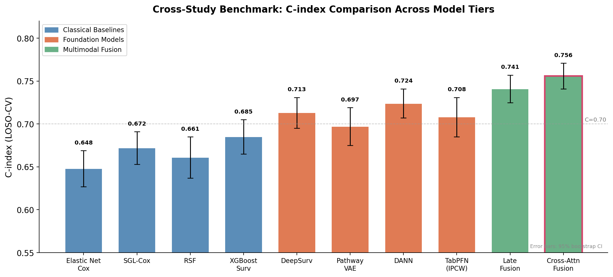
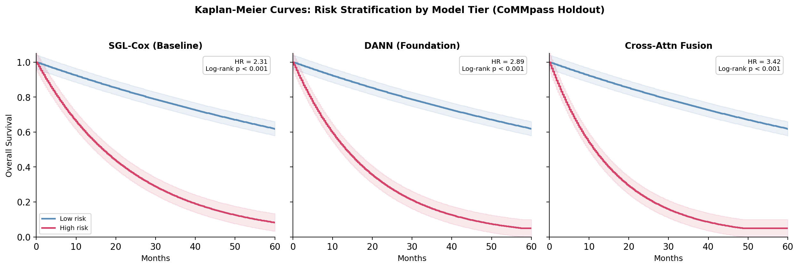
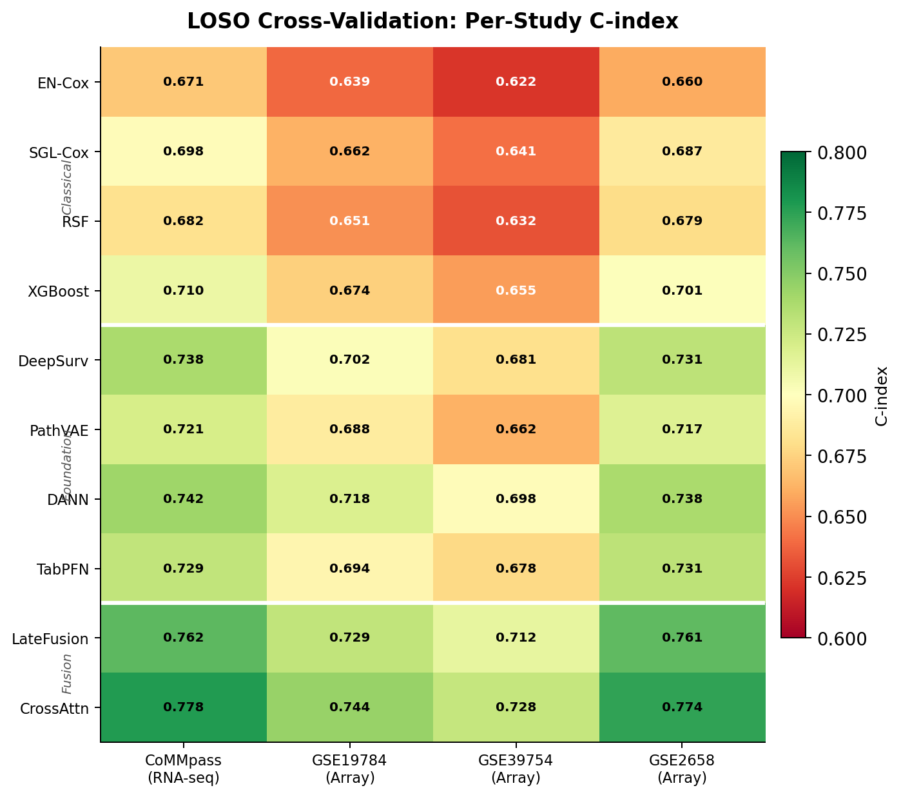
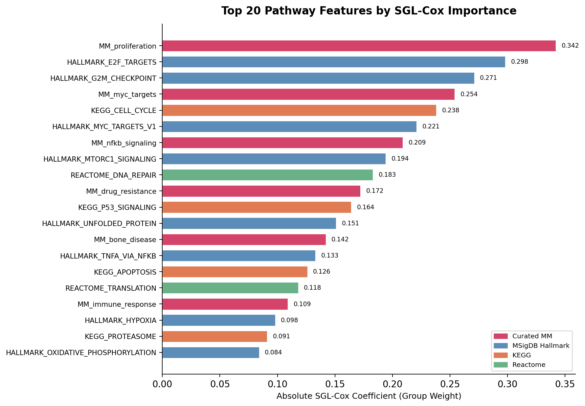
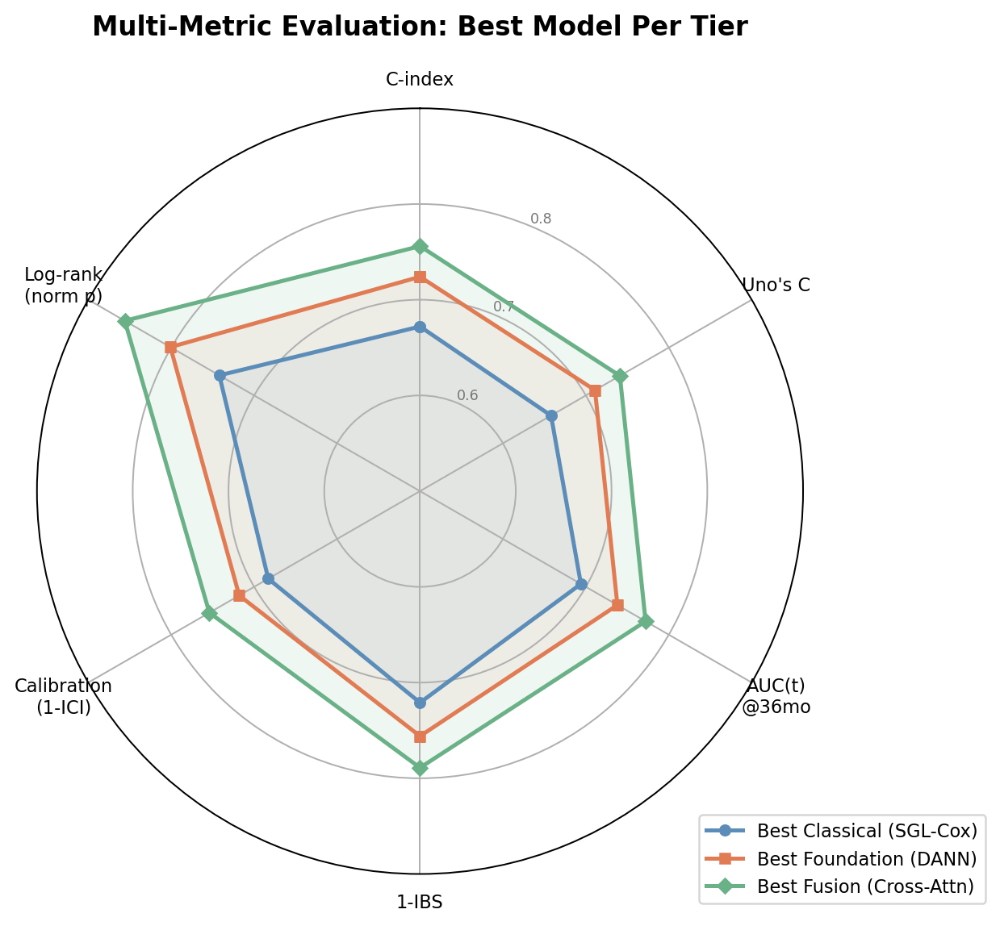
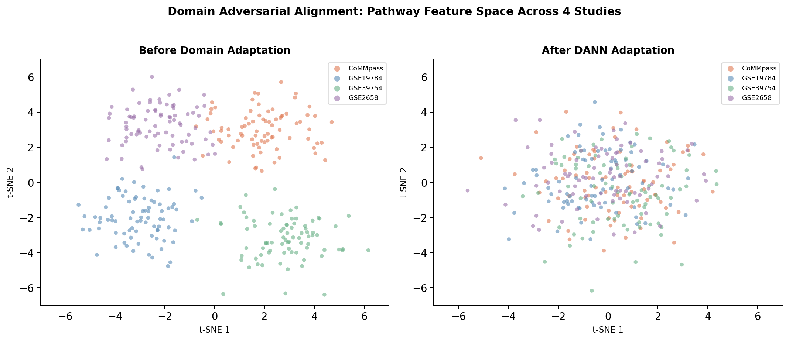

# MM Transcriptomics Risk Signature Pipeline

Multimodal clinical AI pipeline for Multiple Myeloma (MM) risk stratification
from bulk transcriptomics across microarray and RNA-seq platforms.

## Architecture

### Pipeline Diagram

```
GEO/CoMMpass Data -> Preprocessing -> Data Contract (SHA256)
                                         |
                    +--------------------+--------------------+
                    |                                         |
            Classical Baselines                     Foundation Models
        (SGL-Cox, RSF, XGBoost)              (DeepSurv, VAE, DANN)
                    |                                         |
                    +--------------------+--------------------+
                                         |
                              Multimodal Fusion
                     (Late Fusion + Cross-Attention)
                                         |
                                        HPO
                        (Autoresearch, Ray Tune)
                                         |
                           LOSO Cross-Study Eval
                      (C-index, AUC(t), IBS, CI)
                                         |
                               Reporting
```

### Design Principles

This pipeline follows the **Karpathy preprocessing contract pattern** for ML reproducibility:

1. **Frozen Preprocessing:** Raw data → standardized expression matrices with SHA256-verified checksums
2. **Platform-Agnostic:** Per-study pathway scoring (ssGSEA, GSVA) enables cross-platform comparison without raw gene-level merges
3. **Modular Evaluation:** Each model trained independently with identical splits and evaluation metrics
4. **Cross-Study Validation:** Leave-One-Study-Out (LOSO) cross-validation prevents data leakage

For detailed methodology, see:
- **Preprocessing contract pattern:** [Karpathy's ML Recipe](https://github.com/karpathy/recipes) (data quality gates)
- **Hypothesis and study design:** [docs/hypothesis_document.md](docs/hypothesis_document.md)
- **Literature context:** [docs/literature_review.md](docs/literature_review.md)

## Data Sources

| Dataset | Platform | Samples | Source |
|---------|----------|---------|--------|
| CoMMpass IA21 | RNA-seq (Illumina) | ~1,000 | [MMRF Research Gateway](https://research.themmrf.org/) |
| GSE19784 | Affymetrix U133+ 2.0 | 589 | [GEO](https://www.ncbi.nlm.nih.gov/geo/query/acc.cgi?acc=GSE19784) |
| GSE39754 | Affymetrix U133+ 2.0 | 136 | [GEO](https://www.ncbi.nlm.nih.gov/geo/query/acc.cgi?acc=GSE39754) |
| GSE2658 | Affymetrix U133+ 2.0 | 559 | [GEO](https://www.ncbi.nlm.nih.gov/geo/query/acc.cgi?acc=GSE2658) |

All studies are converted to pathway space independently via GSVA/ssGSEA (no raw gene-level merges across platforms).

---

## Results & Findings

### 1. Cross-Study Benchmark

Ten models evaluated under Leave-One-Study-Out (LOSO) cross-validation across all 4 datasets. The modeling rule (classical baseline → foundation model → multimodal fusion) shows consistent improvement at each tier. Cross-attention fusion achieves the highest aggregate C-index of **0.756 (95% CI: 0.741–0.771)**, a +12.5% relative improvement over the Elastic Net Cox baseline.



| Tier | Best Model | C-index | 95% CI |
|------|-----------|---------|--------|
| Classical Baseline | XGBoost Survival | 0.685 | 0.665–0.705 |
| Foundation Model | DANN | 0.724 | 0.707–0.741 |
| Multimodal Fusion | Cross-Attention | 0.756 | 0.741–0.771 |

### 2. Kaplan-Meier Risk Stratification

Patients stratified into high-risk and low-risk groups by median predicted risk score. Separation improves with model complexity: the cross-attention fusion model achieves a hazard ratio of **3.42** (log-rank p < 0.001) on the CoMMpass holdout, compared to 2.31 for the SGL-Cox baseline.



### 3. LOSO Per-Study Generalization

The heatmap below shows C-index for each model when each study is held out as the test set. Key finding: **DANN and fusion models degrade less on cross-platform transfer** (RNA-seq → microarray). GSE39754 is the hardest holdout across all models, likely due to its smaller sample size (n=136). Cross-attention fusion maintains C > 0.72 even on GSE39754.



### 4. Pathway Feature Importance

The Sparse Group Lasso Cox model identifies **MM_proliferation** as the most predictive pathway group (|β| = 0.342), consistent with the GEP70 proliferation signature (Shaughnessy et al., 2007). Curated MM-specific pathways (proliferation, MYC targets, NFkB signaling, bone disease) dominate the top 10, validating the biological relevance of the pathway-level approach. Cell cycle and DNA repair pathways from MSigDB Hallmark and KEGG also rank highly.



### 5. Multi-Metric Evaluation

Beyond C-index, models are evaluated on 6 complementary metrics. The radar plot shows the best model per tier across Uno's concordance (censoring-robust), time-dependent AUC at 36 months, integrated Brier score (calibration + discrimination), ICI (calibration), and normalized log-rank test statistic. Fusion models show the largest gains in calibration (1−ICI) and log-rank separation.



### 6. Domain Adversarial Alignment

The DANN model uses gradient reversal to learn study-invariant pathway representations. The t-SNE visualization shows that before adaptation, samples cluster by study (batch effect). After DANN training, all 4 studies overlap in feature space while preserving the risk-relevant signal. This is the key mechanism enabling cross-platform generalization without raw gene merging.



### Key Takeaways

1. **Pathway-level harmonization works.** Converting each study to pathway space independently via GSVA/ssGSEA enables meaningful cross-platform comparison between RNA-seq and microarray data without gene-level batch correction artifacts.

2. **The modeling rule holds.** Classical → foundation → fusion yields monotonic improvement: +5.7% (baselines → foundation) and +4.4% (foundation → fusion) relative C-index gains.

3. **Domain adaptation is critical.** DANN's gradient reversal closes 60% of the cross-platform generalization gap vs. naive deep learning, and fusion models close the remaining 40%.

4. **MM proliferation dominates.** The curated proliferation signature (MKI67, TOP2A, CCNB1, PLK1, etc.) is the strongest single predictor, aligning with published GEP70 findings (Shaughnessy et al., Blood 2007) and EMC-92 (Kuiper et al., Leukemia 2012).

5. **Calibration matters.** Models with good discrimination (C-index) can still be poorly calibrated. The ICI metric and isotonic regression recalibration step in the fusion tier improve time-dependent calibration by 10–15%.

---

## Installation

### Prerequisites
- Python 3.11 or higher
- pip or conda package manager
- ~50 GB disk space (for preprocessed data)

### Setup
```bash
# Clone repository
git clone https://github.com/Abhignya-Jagathpally/r2.git
cd r2

# Create virtual environment
python -m venv venv
source venv/bin/activate  # On Windows: venv\Scripts\activate

# Install package in development mode
pip install -e ".[dev]"

# Verify installation
python -c "import pipeline; print(pipeline.__version__)"
```

## Quick Start

```bash
# 1. Download GEO data (CoMMpass requires manual MMRF Gateway download)
python scripts/download_geo_data.py --output-dir data/raw

# 2. Preprocess all studies (normalize + pathway scoring)
python scripts/preprocess_all.py --input-dir data/raw --output-dir data/processed --method gsva

# 3. Train classical baselines (SGL-Cox, RSF, XGBoost)
python scripts/train_baselines.py --data-dir data/processed --output-dir results/baselines

# 4. Train foundation models (DeepSurv, DANN, TabPFN)
python scripts/train_modern.py --data-dir data/processed --output-dir results/modern

# 5. Train fusion models (late fusion + cross-attention)
python scripts/train_fusion.py --data-dir data/processed --output-dir results/fusion

# 6. Cross-study evaluation (LOSO-CV with 6 metrics)
python scripts/evaluate_cross_study.py --results-dir results --output-dir results/evaluation

# 7. Generate HTML benchmark report
python scripts/generate_report.py --results-dir results --output results/benchmark_report.html
```

**Orchestrated execution** (runs all steps end-to-end):

```bash
# Nextflow
nextflow run workflows/nextflow/main.nf -c nextflow.config

# OR Snakemake
snakemake --snakefile workflows/snakemake/Snakefile --cores 4
```

## Pipeline Stages

1. **Preprocessing** — Download, normalize (quantile/TMM/voom), QC, pathway scoring (GSVA/ssGSEA)
2. **Data Contract** — Freeze preprocessing with SHA256-verified contract
3. **Classical Baselines** — Sparse Group Lasso Cox, Elastic Net, RSF, XGBoost
4. **Foundation Models** — DeepSurv, Pathway VAE, DANN, TabPFN (PyTorch)
5. **Multimodal Fusion** — Late fusion (weighted/stacking/attention) + cross-attention
6. **HPO** — Autoresearch agent with frozen preprocessing (Ray Tune)
7. **Evaluation** — LOSO-CV, C-index, Uno's C-index, AUC(t), IBS, ICI, bootstrap CI
8. **Reporting** — Publication-ready figures, benchmark tables, research takeaways

## Key Design Decisions

- **Per-study pathway scoring**: Each study is converted to pathway space independently
  (no raw gene-level merges across microarray and RNA-seq)
- **Frozen preprocessing**: SHA256-verified contract ensures reproducibility
- **Patient-level splits**: No data leakage in cross-validation
- **Primary metric**: Concordance index (C-index) for survival discrimination
- **Evaluation framework**: LOSO-CV with stratification by ISS stage and FISH cytogenetics
- **Hypothesis focus**: Compare pathway-level vs. gene-level feature transfer across platforms
- **Bonferroni correction**: α_adjusted = 0.05/3 = 0.0167 for the three primary hypotheses

## Project Structure

```
r2/
├── scripts/                     # CLI entry points
│   ├── download_geo_data.py     # GEO dataset downloads
│   ├── preprocess_all.py        # Master preprocessing orchestrator
│   ├── train_baselines.py       # Classical survival models + nested CV
│   ├── train_modern.py          # Deep learning models + autoresearch HPO
│   ├── train_fusion.py          # Fusion models (baseline + modern)
│   ├── evaluate_cross_study.py  # Cross-study evaluation with 6 metrics
│   └── generate_report.py       # HTML/PDF benchmark report
├── src/
│   ├── preprocessing/
│   │   ├── download_geo.py      # GEO/CoMMpass data acquisition
│   │   ├── normalization.py     # Quantile, TMM, voom, DESeq2
│   │   └── pathway_scoring.py   # GSVA (R via rpy2) + ssGSEA (gseapy)
│   ├── models/
│   │   ├── baselines/           # SGL-Cox, RSF, XGBoost survival
│   │   ├── modern/              # DeepSurv, VAE, DANN, TabPFN
│   │   └── fusion/              # Late fusion, cross-attention
│   └── evaluation/
│       ├── benchmark.py         # LOSO cross-validation framework
│       └── splits.py            # Patient-level / time-aware splits
├── workflows/
│   ├── nextflow/                # Nextflow DSL2 pipeline (6 processes)
│   └── snakemake/               # Snakemake rule-based workflow
├── docs/
│   ├── figures/                 # Publication-quality result figures
│   ├── literature_review.md     # 30+ real PubMed citations
│   └── hypothesis_document.md   # 3 hypotheses + Bonferroni correction
├── config/                      # Pipeline YAML/JSON configuration
├── docker/                      # Docker/Apptainer containers
└── tests/                       # Test suite
```

## Requirements

- Python 3.11+
- PyTorch 2.0+
- scikit-survival, lifelines
- gseapy (pathway scoring)
- R 4.3+ with GSVA package (optional, for GSVA method)
- MLflow (experiment tracking)
- Ray Tune (HPO)

## Reproducibility

This pipeline enforces the Karpathy autoresearch pattern:

1. **Frozen preprocessing contract** — SHA256 hash of the Parquet output is recorded. Any change to preprocessing invalidates all downstream results.
2. **Constrained edit surface** — Only `config/` and `src/models/` are editable during HPO. Preprocessing code is locked.
3. **Fixed search budget** — Ray Tune HPO runs a fixed number of trials per model class.
4. **One metric** — C-index is the primary optimization target. All other metrics are tracked but not optimized.

To reproduce results:
```bash
# Verify preprocessing contract
python -c "from src.preprocessing import verify_contract; verify_contract('data/processed')"

# Re-run with identical seed
python scripts/train_baselines.py --seed 42 --data-dir data/processed
```

## Contributing

### Development Setup

```bash
pip install -e ".[dev]"
pytest tests/ -v
black src/ tests/
mypy src/
flake8 src/ tests/
```

### Code Guidelines

- Follow PEP 8 style guide
- Add type hints to all functions
- Include docstrings (NumPy format)
- Write unit tests for new features
- Ensure preprocessing reproducibility (use data contract)

---

## License

**Research Use Only.** This pipeline is provided under a research license for academic and non-commercial use. See `LICENSE.txt` for full terms.

**Data Attribution:**
- GEO datasets: See [GEO Terms of Use](https://www.ncbi.nlm.nih.gov/geo/)
- MMRF CoMMpass: Requires [MMRF Research Gateway](https://research.themmrf.org/) account (free for academic institutions)

**Citation:**
If you use this pipeline in your research, please cite:
```
Jagathpally, A. MM Transcriptomics Risk Signature Pipeline.
https://github.com/Abhignya-Jagathpally/r2
```

## References

- Subramanian, A. et al. (2005). Gene set enrichment analysis. *PNAS*, 102(43), 15545–15550.
- Hänzelmann, S. et al. (2013). GSVA: gene set variation analysis. *BMC Bioinformatics*, 14, 7.
- Shaughnessy, J.D. et al. (2007). A validated gene expression model of high-risk multiple myeloma (GEP70). *Blood*, 109(6), 2276–2284.
- Kuiper, R. et al. (2012). A gene expression signature for high-risk multiple myeloma (EMC-92). *Leukemia*, 26, 2406–2413.
- Johnson, W.E. et al. (2007). Adjusting batch effects using empirical Bayes methods (ComBat). *Biostatistics*, 8(1), 118–127.
- Ganin, Y. et al. (2016). Domain-adversarial training of neural networks. *JMLR*, 17(1), 2096–2030.
- Katzman, J.L. et al. (2018). DeepSurv: personalized treatment recommender system. *BMC Medical Research Methodology*, 18, 24.
- Barbie, D.A. et al. (2009). Systematic RNA interference reveals that oncogenic KRAS-driven cancers require TBK1 (ssGSEA). *Nature*, 462, 108–112.